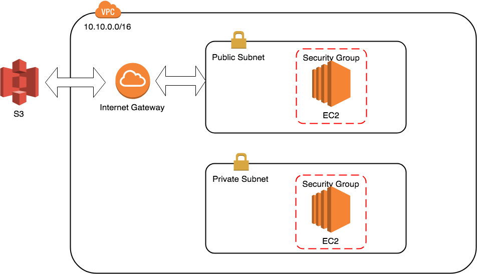
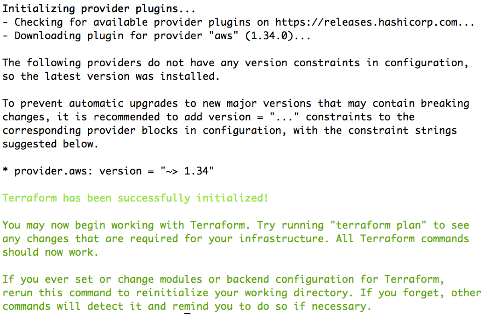
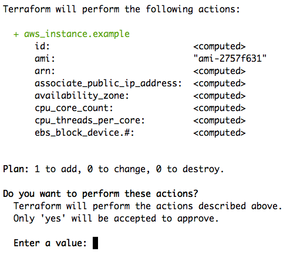
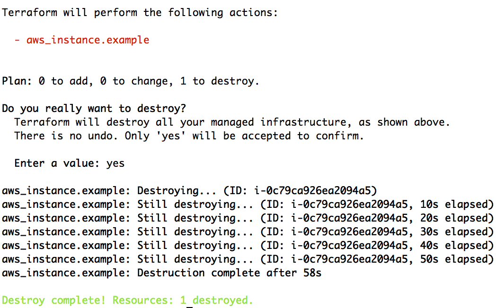

<!--- $size 16:9 --->
# Terraform CH1 Basics

---
# Agenda
- AWS Introduce
  - VPC/EC2/Security Group/ELB/UserData/S3
- Spining up an instance with Terraform
  - Variables
  - Data
  - Output 
  - Remote State (S3)
  - init/apply

---
# Terraform Intro

---
# What is Terraform
- IaC (Infrastructure as Code) Tool	
- Terraform is a tool for building, changing, and versioning infrastructure
- Support Major Cloud Provider (AWS, GCP, Azure ...etc)
- Bunch of Provider (DNS, Database, Monitor System ...etc)

---
# Basic AWS Introduces

---

## AWS Component
- VPC
- Security Group
- EC2
- S3

---
## AWS Component


---
## First EC2 Instance
main.tf
```
provider "aws" {
  region     = "us-east-1"
}

resource "aws_instance" "example" {
  ami           = "ami-2757f631"
  instance_type = "t2.micro"
}
```

---
# Terraform Commands
- init (初始化)
- plan
- apply
- destroy
- get
- graph


---
## Terraform init
`$ terraform init`
# 

---
## Terraform apply
`$ terraform apply`
# 

---
## Terraform state file
`$ cat terraform.tfstate`
It's a JSON file, Terraform use it to map from real world resource to Terraform structures.

---
## Terraform destroy
`$ terraform destroy`
# 

---
## Terraform Remote State
backend.tf
```
terraform {
  backend "s3" {
    bucket = "a-long-name-to-s3-bucket-include-date"
    key    = "prod/terraform.tfstate"
    region = "us-east-1"
  }
}
```

---
## Terraform Remote State
main.tf
```
provider "aws" {
  region     = "us-east-1"
}

resource "aws_instance" "example" {
  ami           = "ami-2757f631"
  instance_type = "t2.micro"
}
```

---
## Terraform Input Variables
variables.tf
```
variable "access_key" {}
variable "secret_key" {}
variable "region" {
  default = "us-east-1"
}
```
main.tf
```
provider "aws" {
  region     = "${var.region}"
}

resource "aws_instance" "example" {
  ami           = "ami-2757f631"
  instance_type = "t2.micro"
}
```

---
## Terraform Input Variables
prod.tfvar
```
region="us-east-1"
```
Execute command:
```
$ terraform init
$ terraform apply -var-file=./prod.tfvar
```
---
# Terraform Output

Output public IP for user can be connect.
Important concept when write module.

---
## Terraform Output
output.tf
```
output "public_ip" {
  value = "${aws_instance.example.public_ip}"
}
```
# 

---
# Genarate ssh key

---
## Genarate ssh key
`$ ssh-keygen -f /home/cloud9/.ssh/id_rsa -P ''`

---
# Create AWS Keypair

---
## Create AWS Keypair
main.tf
```
resource "aws_key_pair" "devopsdays-workshop" {
  key_name   = "devopsdays-workshop"
  public_key = "${file(pathexpand("/home/cloud9/.ssh/id_rsa.pub"))}"
}
```