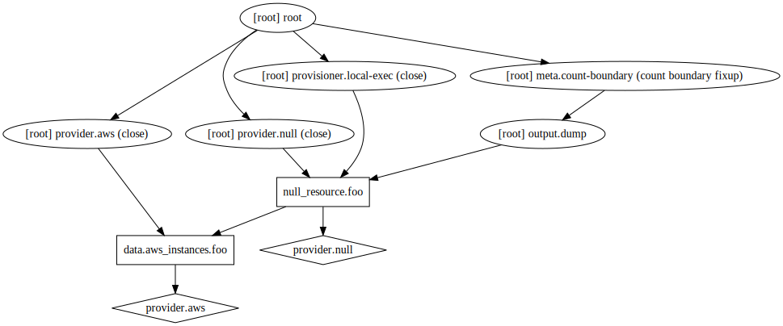

# Template Provider

---

# Template
- exposes `data sources` to custom template
- to generate strings for other Terraform `resources` or `outputs`

---


# Define template

---

# Option 1 - Use template file
```
data "template_file" "init" {
  template = "${file("${path.module}/init.tpl")}"

  vars {
    consul_address = "${aws_instance.consul.private_ip}"
  }
}
```

## In `init.tpl`
```
#!/bin/bash
echo "CONSUL_ADDRESS = ${consul_address}" > /tmp/iplist
```

---

# Option 2 - Use inline template

```
data "template_file" "init" {
  template = "$${consul_address}:1234"

  vars {
    consul_address = "${aws_instance.consul.private_ip}"
  }
}
```
NOTE:
- `$${consul_address}`

---

# Attributes

- template
- vars
- `rendered`

https://www.terraform.io/docs/providers/template/d/file.html#attributes-reference

---


# Use template


---

Template output is stored in `rendered` :

```
output "dump" {
    value = "${data.template_file.my_output.rendered}"
}
```


---

## example: `aws/ch02/examples/2.1-template`
- Use `aws_instance` data source to get running instance
- Retrieve the `public_ip` of `aws_instance` and render template

---

Other provider: Github Provider
https://www.terraform.io/docs/providers/github/index.html

---

## example: `aws/ch02/examples/2.2-github-create-org-repo`
- Create Github access token
	-  https://github.com/settings/tokens/new

- Generate deployment key
	- `ssh-keygen -t rsa -f key`

---

# Null Provider

---

```
-/+ null_resource.cluster (new resource required)
      id:                            "3073545919705261159" => <computed> (forces new resource)
      triggers.%:                    "1" => "1"
      triggers.cluster_instance_ids: "i-0f87175b8613e3859" => "i-0e22c0e820fb5dd9b,i-0f87175b8613e3859" (forces new resource)
```

---


# Terraform Commands
## terraform SUBCOMMANDS

---

# Command: init

---

## Usage: `terraform init [options] [DIR]`
- prepare a working directory
- install module, child module, plugins
- safe to run multiple times
- backend initilization
	- for example: 
      ```
      terraform {
        backend "local" {
          path = "relative/path/to/terraform.tfstate"
        }
      }
      ```

---

```
$ terraform init

$ tree .terraform
.terraform
└── plugins
    └── darwin_amd64
        ├── lock.json
        ├── terraform-provider-aws_v1.35.0_x4
        └── terraform-provider-null_v1.0.0_x4
```

---

# Command: get

---

- it's about `.terraform`
	- downloaded modules
	- should NOT to be commited to VCS
	- use `-update` to update downloaded modules

---

```
$ terraform get
- module.consul
- module.consul.consul_servers
- module.consul.consul_clients
- module.consul.consul_servers.security_group_rules
- module.consul.consul_servers.iam_policies
- module.consul.consul_clients.security_group_rules
- module.consul.consul_clients.iam_policies
```

---

# Command: plan

---

- create an execution plan
- check whether the execution matches your expectations
- *NOT* making any changes to real `resources` or `state`
- use `-out` to save the generated plan for later execution

---

# Command: apply

---

## Usage: terraform apply [options] [dir-or-plan]
- apply changes for current directory
- apply changes from previous excution plan
	- `terraform apply "devopsdays-2018"`

---

# Command: destroy

---

- destroy the **Terraform-managed** infrastructure
- will ask for confirmation before destroying
- you still can `plan` your destroy by
	- `terraform plan -destroy`

---

# Command: graph

---

`terraform graph . | dot -Tsvg > graph.svg`

- Graphviz
	- http://www.graphviz.org/
	- `brew install graphviz`

---

# output graph of example 'Null'



---

