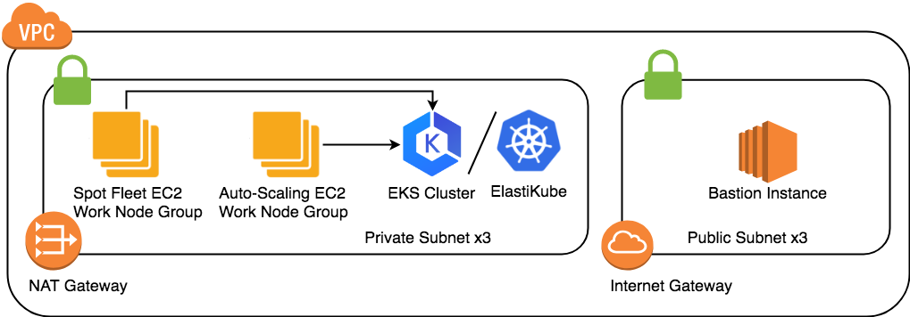

<!-- page_number: true -->

# CH05 EKS

--- 

## EKS Cluster
- repo: [GitHub - getamis/vishwakarma](https://github.com/getamis/vishwakarma)

### Modules
- path: `vishwakarma/aws`
- Terraform modules :
    - network
    - container_linux
    - eks
---

## Preparation
 
### Kubernetes Client Install Guide
- https://kubernetes.io/docs/tasks/tools/install-kubectl/

### AWS IAM Authenticator
- https://github.com/kubernetes-sigs/aws-iam-authenticator
- AWS EKS access permission integrates with AWS IAM, in order to let AWS EKS know whether you have the right to access, heptio-authenticator-aws needs to be [installed](https://docs.aws.amazon.com/eks/latest/userguide/configure-kubectl.html) in the client side

### Key Pair
- In order to access worker node through ssh protocol, please create a key pair in example region US West (Oregon) us-west-2

--- 

### Get Started - Part 1

- `$ git clone https://github.com/getamis/vishwakarma.git`
- `$ cd examples/eks_worker`
- `$ terraform init`
- `$ terraform plan`
```
# need to input the key pair name
var.key_pair_name
  The key pair name for access bastion ec2
Enter a value:
```

--- 

### Get Started - Part 2

- `$ terraform apply`
```
# need to input the key pair name
var.key_pair_name
  The key pair name for access bastion ec2
Enter a value:
```
- `$ export KUBECONFIG=.terraform/kubeconfig`
- `$ kubectl get node`

---

## Vishwakarma Kubernetes



---

## Vishwakarma modules

- **aws/network**
  - One AWS VPC includes private and public subnet
  - One ec2 instance called bastion hosts in public subnet, can access the resource hosting in the private subnet.

- **aws/eks/master**
  - Create the AWS EKS cluster

- **aws/eks/worker-asg**
  - Create a AWS auto-scaling group with CoreOS container linux and leverage ignition to provision
  - Register to EKS cluster automatically

- **aws/eks/worker-spot**

---

- directories:

```
├── container_linux
├── eks
│   ├── ignition
│   │   └── resources
│   │       ├── dropins
│   │       ├── kubernetes
│   │       ├── services
│   │       └── sysctl.d
│   ├── master
│   │   └── resources
│   ├── worker-asg
│   ├── worker-common
│   └── worker-spot
└── network
```

---

### Example
- path: `vishwakarma/examples/eks_worker`
- `main.tf`

#### network 
- code:
```
module "network" {
  source           = "../../aws//network"
  aws_region       = "${var.aws_region}"
  bastion_key_name = "${var.key_pair_name}"
}
```

--- 

## Base VPC Networking
- One VPC
  - One Public Subnet
  - One Private Subnet
  - An internet gateway, and setup the subnet routing to route external traffic through the internet gateway:

- Bastion is a `jump server`
  - https://docs.aws.amazon.com/quickstart/latest/linux-bastion/architecture.html

--- 

## AWS VPC in Terraform 

--- 

### EKS Master Module
- module: `vishwakarma/aws/eks/master`
- files:
```
└── master
    ├── aws-auth-cm.tf
    ├── cluster.tf
    ├── main.tf
    ├── outputs.tf
    ├── resources
    │   ├── aws-auth-cm.yaml.tpl
    │   └── kubeconfig
    ├── role.tf
    ├── s3.tf
    ├── sg.tf
    └── variables.tf
```

--- 

## Kubernetes Master
- This is where the EKS service comes into play. 
- need
  - VPC
  - IAM
  - SecurityGroup

---

### IAM Roles
- File: `aws/eks/master/role-eks.tf`
- Purpose:
  - Create IAM Role `AWSServiceRoleForAmazonEKS`
  - Uses the following IAM policies:
    - `AmazonEKSServicePolicy`
    - `AmazonEKSClusterPolicy`
- Terraform Resources
  - `aws_iam_role`
  - `aws_iam_policy_document`
  - `aws_iam_role_policy_attachment`

---

### EKS Cluster Security Group
- File: `aws/eks/master/security-group-eks.tf`
- Purpose:
  - Cluster communication with worker nodes
  - Allow instances in VPC to communicate with the cluster API Server
- Terraform Resources
  - `aws_security_group`
  - `aws_security_group_rule`
    - `eks_cluster_egress` 
    - `eks_cluster_ingress_https`

---

### EKS Cluster Master 
- File `aws/eks/master/cluster.tf`
- Purpose:
  - Create Cluster Master with EKS Service
- Terraform Resources
  - `aws_eks_cluster`
  - Notice: `depends_on`

---

### Obtaining kubectl Configuration From Terraform
- File: `aws/eks/master/s3-kubeconfig.tf`
- Purpose:
  - Generate the kubeconfig file for kubectl
  - save the kubeconfig in S3
- Terraform Resources
  - `template_file`
  - `local_file`
  - `aws_s3_bucket`
  - `aws_s3_bucket_object`

---

### Required Kubernetes Configuration to Join Worker Nodes

- File:`aws/eks/master/aws-auth-cm.tf`
- Purpose:
  - The EKS service does not provide a cluster-level API parameter or resource to automatically configure the underlying Kubernetes cluster to allow worker nodes to join the cluster via AWS IAM role authentication.
  - To output an example IAM Role authentication ConfigMap from your Terraform configuration
  - Kubectl apply the ConfigMap
- Terraform Resources
  - `template_file`
  - `local_file`
  - `null_resource`

---

## Kubernetes Worker Nodes
- worker_common
  - Initailization of EC2 Instance
- wroker_asg
  - Preparation for added into Kubernetes Cluster

---

### Worker Node IAM Role and Instance Profile
- File: `aws/eks/worker-common/role.tf`
- Purpose:
  - IAM role and policy to allow the worker nodes to manage or retrieve data from other AWS services. 
  - It is used to allow worker nodes to join the cluster.
  - Create IAM Role `EKSWorkerAssumeRole`
  - Policy 
    - `AmazonEKSWorkerNodePolicy`
    - `AmazonEKS_CNI_Policy`
    - `AmazonEC2ContainerRegistryReadOnly`
	- `s3:GetObject`

---

### Worker Node Security Group

- File: `aws/eks/master/security-group-worker.tf`
- Purpose:
  - Controls networking access to the Kubernetes worker nodes.
  	- `workers_egress_internet`
    - `workers_ingress_self`
    - `workers_ingress_cluster`
    - `workers_ingress_ssh`
    - `worker_ingress_lb`
      - Kubernetes NodePort

---

### Ｗorker Node AutoScaling Group
- File: `aws/eks/worker-asg/asg.tf`
- Purpose:
  - This setup utilizes an EC2 AutoScaling Group (ASG) rather than manually working with EC2 instances. 
  - This offers flexibility to scale up and down the worker nodes on demand.


---

### AMI
- First, let us create a data source to fetch the latest Amazon Machine Image (AMI) that Amazon provides with an EKS compatible Kubernetes baked in.
- `aws/eks/worker-asg/asg.tf`
  - `aws_autoscaling_group`
    - `aws_launch_configuration`
      - `aws_launch_configuration`
        - `image_id             = "${coalesce(var.ec2_ami, module.worker_common.coreos_ami_id)}"`

---

### AMI for module
- `module.worker_common.coreos_ami_id`
- `aws/eks/worker-common/ami.tf`
- ``module.container_linux`
  - try to get latest version of coreos, if needed
```
data "aws_ami" "coreos_ami" {
  filter {
    name   = "name"
    values = ["CoreOS-${var.container_linux_channel}-${module.container_linux.version}-*"]
  }
  filter {
    name   = "architecture"
    values = ["x86_64"]
  }
  filter {
    name   = "virtualization-type"
    values = ["hvm"]
  }
  filter {
    name   = "owner-id"
    values = ["${local.ami_owner}"]
  }
}
```
---

###  AutoScaling Launch Configuration
- `aws/eks/worker-asg/asg.tf`
  - `aws_autoscaling_group`
    - `aws_launch_configuration`

```
resource "aws_launch_configuration" "workers" {
......
  user_data            = "${module.worker_common.ign_config_rendered}"

......
}

```

---

###  User Data - ignition
- Ignition is a new provisioning utility designed specifically for CoreOS Container Linux. 
- https://coreos.com/ignition/docs/latest/

- `aws/eks/ignition`
- `aws/eks/worker_common/ignition`
  - locksmithd
  - docker
  - ca
  - heptio_authenticator_aws
  - kubelet

---

###  User Data - ignition - utilities

```
data "ignition_config" "main" {
  files = ["${compact(list(
    module.ignition_worker.max_user_watches_id,
    module.ignition_worker.ntp_dropin_id,
    module.ignition_worker.client_ca_file_id,
    module.ignition_worker.kubeconfig_id,
    module.ignition_worker.kubelet_env_id,
   ))}"
  ]

  systemd = [
    "${module.ignition_worker.locksmithd_service_id}",
    "${module.ignition_worker.docker_dropin_id}",
    "${module.ignition_worker.update_ca_certificates_dropin_id}",
    "${module.ignition_worker.heptio_authenticator_aws_id}",
    "${module.ignition_worker.kubelet_service_id}",
  ]
}
```

---

