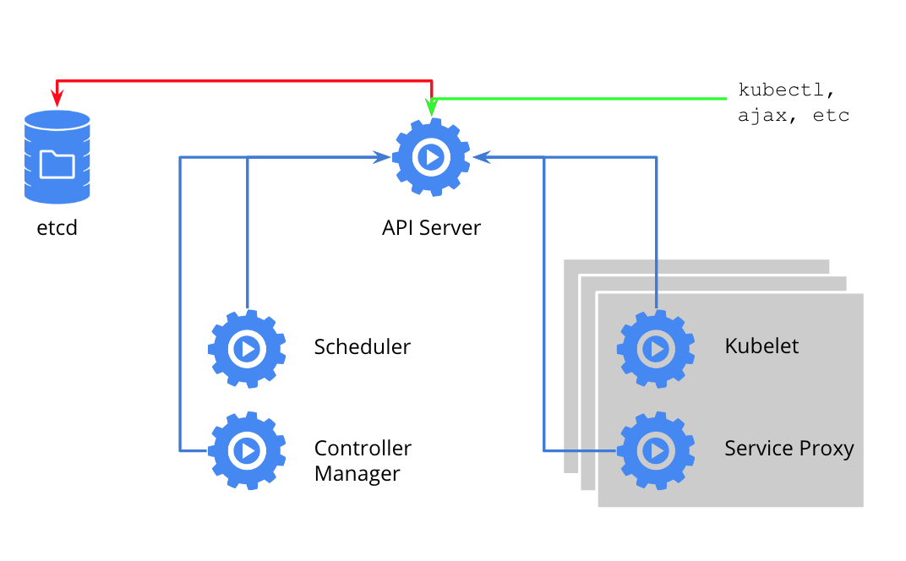
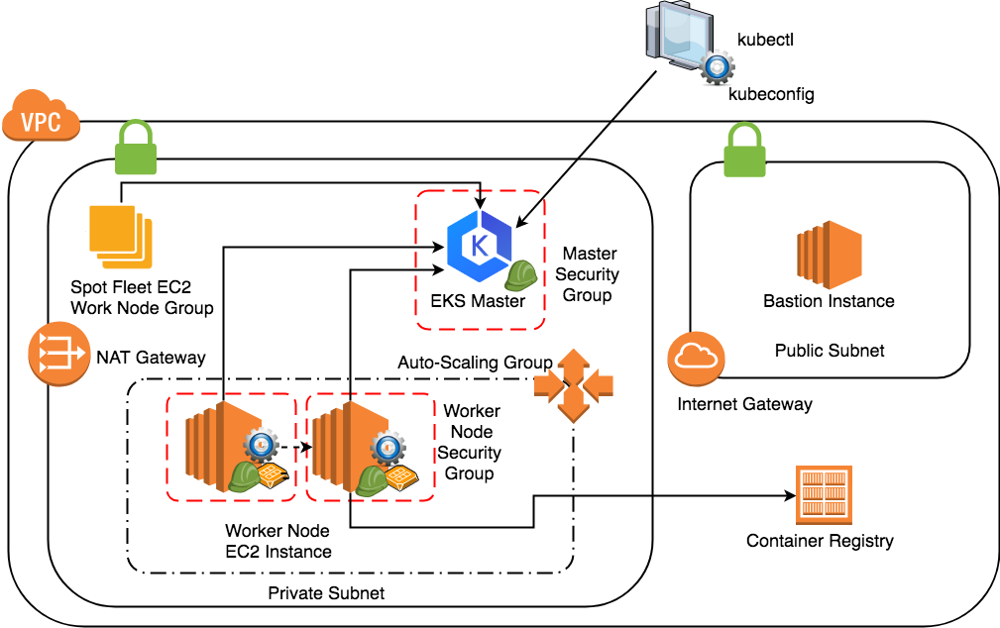
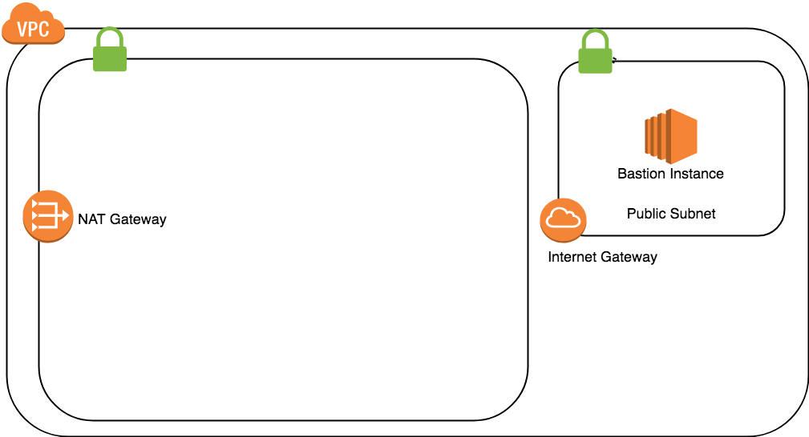
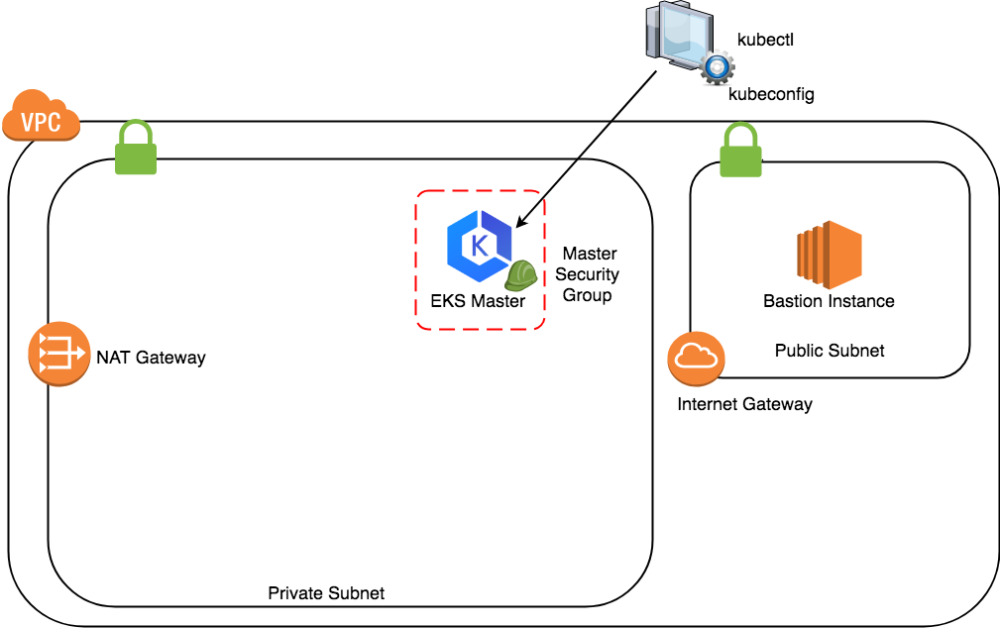
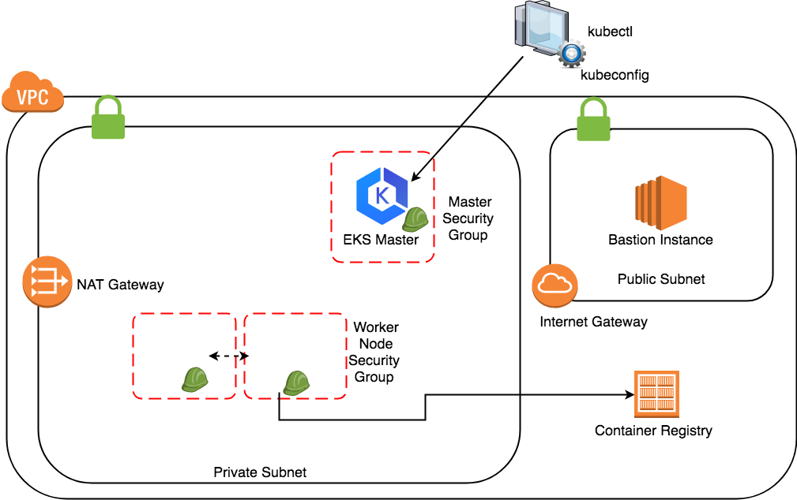
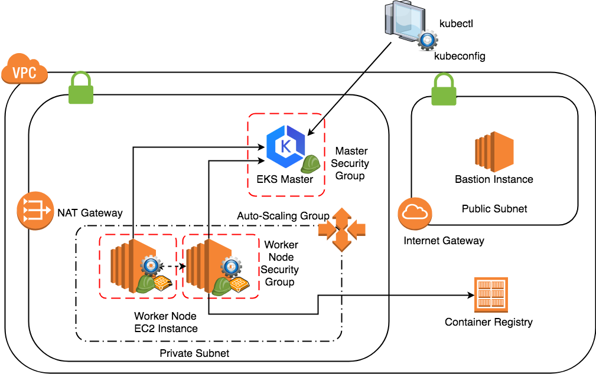

<!-- page_number: true -->

# CH05 EKS with Terraform

---

## Objectives

- ### Kubernetes & EKS Overview
- ### Make a EKS Clsuter with Terraform
- ### Concept about making a EKS Cluster for production with Terraform

--- 

## Preparation
 
### Kubernetes Client 
- https://kubernetes.io/docs/tasks/tools/install-kubectl/

### AWS IAM Authenticator
- https://github.com/kubernetes-sigs/aws-iam-authenticator
  - AWS EKS access permission integrates with AWS IAM
  - heptio-authenticator-aws needs to be [installed](https://docs.aws.amazon.com/eks/latest/userguide/configure-kubectl.html) in the client side

### Key Pair
- In order to access worker node through ssh protocol, please create a key pair in example region US West (Oregon) us-west-2

--- 

### Practice - Part 1

- `$ git clone https://github.com/getamis/vishwakarma.git`
- `$ cd examples/eks_worker`
- `$ terraform init`
- `$ terraform plan`
```
# need to input the key pair name
var.key_pair_name
  The key pair name for access bastion ec2
Enter a value:
```
- `devopsdays-workshop`
- `$ terraform apply`
--- 


## Kubernetes

- Open Source 
- Container Automation Framework
- Container Orchestrator  
- Open API Based on Google’s experiences

---

## Kubernetes Overview


---

## Kubernetes Architecture



---

## Vishwakarma EKS Cluster



---

## Vishwakarma
- repo: [GitHub - getamis/vishwakarma](https://github.com/getamis/vishwakarma)

### Modules
- path: `vishwakarma/aws`
- Terraform modules :
    - network
    - container_linux
    - eks
---

- ### Directories:

```
├── container_linux
├── eks
│   ├── ignition
│   │   └── resources
│   │       ├── dropins
│   │       ├── kubernetes
│   │       ├── services
│   │       └── sysctl.d
│   ├── master
│   │   └── resources
│   ├── worker-asg
│   ├── worker-commonw
│   └── worker-spot
└── network
```
---

## Vishwakarma aws & eks modules

- ### aws/network
  - One AWS VPC includes private and public subnet
  - One EC2 instance called bastion hosts in public subnet, can access the resource hosting in the private subnet.

- ### aws/eks/master
  - Create the AWS EKS cluster

- ### aws/eks/worker-asg
  - Create a AWS auto-scaling group with CoreOS container linux and leverage ignition to provision
  - Register to EKS cluster automatically

- ### aws/eks/worker-spot

--- 

## Terraform resource dependencies

- multiple resources and how to reference the attributes of other resources to configure subsequent resources.

```
resource "aws_instance" "example" {
  ami           = "ami-2757f631"
  instance_type = "t2.micro"
}
resource "aws_eip" "ip" {
  instance = "${aws_instance.example.id}"
}
```

--- 

## Terraform implicit Dependencies dependencies

- Terraform can automatically infer when one resource depends on another. 
- Terraform uses this dependency information to determine the correct order in which to create the different resources.

- https://www.terraform.io/intro/getting-started/dependencies.html

---

## Example

- File: [examples/eks_worker/main.tf](https://github.com/getamis/vishwakarma/blob/master/examples/eks_worker/main.tf)

- Simple expression of dependencies 
```
workers_asg
 	└──> master
	│      	└──> network
	└──> worker-asg
    		└──> worker-common

```
- `terraform graph`

---

## EKS Cluster Network



--- 

## EKS Cluster Network Details

- One VPC
  - One public Subnet
  - One private Subnet
  - One internet gateway
  - One NAT gateway
  - setup the subnet routing to route external traffic through the gateways:

- Bastion is a `jump server`
  - https://docs.aws.amazon.com/quickstart/latest/linux-bastion/architecture.html


---

## EKS Cluster Master



--- 

### EKS Cluster Master 
- module: [aws/eks/master](https://github.com/getamis/vishwakarma/tree/master/aws/eks/master)
- This is where the EKS service comes into play. 

--- 

## EKS Cluster Master Permission

- ### File: [aws/eks/master/role-eks.tf](https://github.com/getamis/vishwakarma/blob/master/aws/eks/master/role-eks.tf)

- ### Purpose:
  - ####  Give the suitable permission for access EKS Service And Create EKS Cluster

---

### EKS Cluster Master Permission - IAM Roles

- File: [aws/eks/master/role-eks.tf](https://github.com/getamis/vishwakarma/blob/master/aws/eks/master/role-eks.tf)

- Action:
  - Create IAM Role `AWSServiceRoleForAmazonEKS`
  - Uses the following IAM policies:
    - `AmazonEKSServicePolicy`
    - `AmazonEKSClusterPolicy`

- Terraform Resources
  - `aws_iam_role`
  - `aws_iam_policy_document`
  - `aws_iam_role_policy_attachment`

---

## EKS Cluster Master Firewall

- ### File: [aws/eks/master/security-group-eks.tf](https://github.com/getamis/vishwakarma/blob/master/aws/eks/master/security-group-eks.tf)
- 

- ### Purpose:
  - #### Cluster communication with worker nodes
  - #### Allow instances in VPC to communicate with the cluster API Server

--- 

### EKS Cluster Master Firewall - Security Group

- File: [aws/eks/master/security-group-eks.tf](https://github.com/getamis/vishwakarma/blob/master/aws/eks/master/security-group-eks.tf)

- Action:
  - AWS Security Group
    - `eks_cluster_egress` 
    - `eks_cluster_ingress_https`

- Terraform Resources
  - `aws_security_group`
  - `aws_security_group_rule`

---

## EKS Cluster Master

- ### File: [aws/eks/master/cluster.tf](https://github.com/getamis/vishwakarma/blob/master/aws/eks/master/cluster.tf)

- ### Purpose:
  - #### Create Cluster Master with EKS Service

---

### EKS Cluster Master - Create Master 

- File [aws/eks/master/cluster.tf](https://github.com/getamis/vishwakarma/blob/master/aws/eks/master/cluster.tf)

- Action:
  - Create Cluster Master with EKS Service

- Terraform Resources
  - `aws_eks_cluster`
  - Notice: `depends_on`

---

## Obtaining kubectl Configuration 
- ### File: [aws/eks/master/s3-kubeconfig.tf](https://github.com/getamis/vishwakarma/blob/master/aws/eks/master/s3-kubeconfig.tf)

- ### Purpose:
  - #### Generate the kubeconfig file for kubectl
  - #### Save the kubeconfig in AWS S3 for using in future

---


### Obtaining kubectl Configuration

- File: [aws/eks/master/s3-kubeconfig.tf](https://github.com/getamis/vishwakarma/blob/master/aws/eks/master/s3-kubeconfig.tf)

- Action:
  - render kubeconfig with data from eks
  - create S3 bucket for saving the kubeconfig

- Terraform Resources
  - `template_file`
  - `local_file`
  - `aws_s3_bucket`
  - `aws_s3_bucket_object`

---

### Kubernetes Configuration to Join Worker Nodes

- ### File: [aws/eks/master/aws-auth-cm.tf](https://github.com/getamis/vishwakarma/blob/master/aws/eks/master/aws-auth-cm.tf)

- ### Purpose:
  - #### Allow worker nodes to join the cluster via AWS IAM role authentication.

---

### Kubernetes Configuration to Join Worker Nodes

- File: [aws/eks/master/aws-auth-cm.tf](https://github.com/getamis/vishwakarma/blob/master/aws/eks/master/aws-auth-cm.tf)

- Action:
	- To output an example IAM Role authentication ConfigMap from your Terraform configuration
  	- Kubectl apply the ConfigMap

- Terraform Resources
  - `template_file`
  - `local_file`
  - `null_resource`

---


## EKS Cluster Worker Nodes

- [wroker-asg](https://github.com/getamis/vishwakarma/tree/master/aws/eks/worker-asg)
  - Initailization of EC2 Instance (AMI)
  - Preparation for added into Kubernetes Cluster

- [worker-common](https://github.com/getamis/vishwakarma/tree/master/aws/eks/worker-common)
  - Permission
  - Firewall

---

## worker-common



---

## Worker Node Permission - IAM Role and Instance Profile

- ### File: [aws/eks/worker-common/role.tf](https://github.com/getamis/vishwakarma/blob/master/aws/eks/worker-common/role.tf)

- ### Purpose:
  - #### IAM role and policy to allow the worker nodes to manage or retrieve data from other AWS services.
    - #### Network
    - #### ContainerRegistry
  - #### It is used to allow worker nodes to join the cluster.


---

### Worker Node Permission - IAM Role and Instance Profile

- File: [aws/eks/worker-common/role.tf](https://github.com/getamis/vishwakarma/blob/master/aws/eks/worker-common/role.tf)

- Action:
  - Create IAM Role `EKSWorkerAssumeRole`
  - Policy 
    - `AmazonEKSWorkerNodePolicy`
    - `AmazonEKS_CNI_Policy`
    - `AmazonEC2ContainerRegistryReadOnly`
	- `s3:GetObject`

---

## Worker Node Filewall

- ### File: [aws/eks/master/security-group-worker.tf](https://github.com/getamis/vishwakarma/blob/master/aws/eks/master/security-group-worker.tf)

- ### Purpose:
  - ### Controls networking access to the Kubernetes worker nodes.

---

### Worker Node Filewall - Security Group

- File: [aws/eks/master/security-group-worker.tf](https://github.com/getamis/vishwakarma/blob/master/aws/eks/master/security-group-worker.tf)

- Purpose:
  - Controls networking access to the Kubernetes worker nodes.

- Action:
  - AWS Security Group
  	- `workers_egress_internet`
    - `workers_ingress_self`
    - `workers_ingress_cluster`
    - `workers_ingress_ssh`
    - `worker_ingress_lb`
      - Kubernetes NodePort
---

## worker-asg



---

### Ｗorker Node AutoScaling Group

- File: [aws/eks/worker-asg/asg.tf](https://github.com/getamis/vishwakarma/blob/master/aws/eks/worker-asg/asg.tf)

- Purpose:
  - This setup utilizes an EC2 AutoScaling Group (ASG) rather than manually working with EC2 instances. 
  - This offers flexibility to scale up and down the worker nodes on demand.


---

### AMI

- First, let us create a data source to fetch the latest Amazon Machine Image (AMI) that Amazon provides with an EKS compatible Kubernetes baked in.

- [aws/eks/worker-asg/asg.tf](https://github.com/getamis/vishwakarma/blob/master/aws/eks/worker-asg/asg.tf)
  - `image_id             = "${coalesce(var.ec2_ami, module.worker_common.coreos_ami_id)}"`

---

### AMI with Terraform module

- `module.worker_common.coreos_ami_id`
  - File: [aws/eks/worker-common/ami.tf](https://github.com/getamis/vishwakarma/blob/master/aws/eks/worker-common/ami.tf)
  - `module.container_linux`
    - try to get latest version of coreos, if needed

---

###  AutoScaling Launch Configuration

- [aws/eks/worker-asg/asg.tf](https://github.com/getamis/vishwakarma/blob/master/aws/eks/worker-asg/asg.tf)
  - `aws_autoscaling_group`
    - `aws_launch_configuration`

```
resource "aws_launch_configuration" "workers" {
......
  user_data            = "${module.worker_common.ign_config_rendered}"

......
}

```

---

###  User Data - ignition

- Ignition is a new provisioning utility designed specifically for CoreOS Container Linux. 
- https://coreos.com/ignition/docs/latest/

- File: [aws/eks/worker-common/ignition.tf](https://github.com/getamis/vishwakarma/blob/master/aws/eks/worker-common/ignition.tf)

- File: [aws/eks/ignition](https://github.com/getamis/vishwakarma/blob/master/aws/eks/ignition)
  - locksmithd
  - docker
  - ca
  - heptio_authenticator_aws
  - kubelet

---

###  User Data - ignition - utilities
- File: [aws/eks/worker-common/ignition.tf](https://github.com/getamis/vishwakarma/blob/master/aws/eks/worker-common/ignition.tf)
```
data "ignition_config" "main" {
  files = ["${compact(list(
    module.ignition_worker.max_user_watches_id,
    module.ignition_worker.ntp_dropin_id,
    module.ignition_worker.client_ca_file_id,
    module.ignition_worker.kubeconfig_id,
    module.ignition_worker.kubelet_env_id,
   ))}"
  ]

  systemd = [
    "${module.ignition_worker.locksmithd_service_id}",
    "${module.ignition_worker.docker_dropin_id}",
    "${module.ignition_worker.update_ca_certificates_dropin_id}",
    "${module.ignition_worker.heptio_authenticator_aws_id}",
    "${module.ignition_worker.kubelet_service_id}",
  ]
}
```

---

### Practice - Part 2

- `$ export KUBECONFIG=.terraform/kubeconfig`
- `$ kubectl cluster-info`
- `$ kubectl get node`

---

## Key Takeaways


- ### Kubernetes & EKS Overview
  - Kubernetes Architecture Concept
  - EKS Master
  - EKS WorkNode
- ### Make a EKS Clsuter with Terraform
  - AWS EKS Service
  - Other Service ...
- ### Concept about making a EKS Cluster for production with Terraform
  - Terraform module & resource dependencies
  - Network & Firewall
  - Instances & Utilities

---